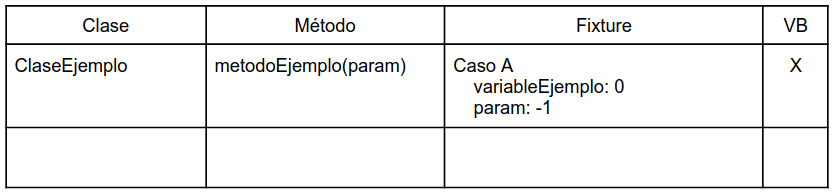
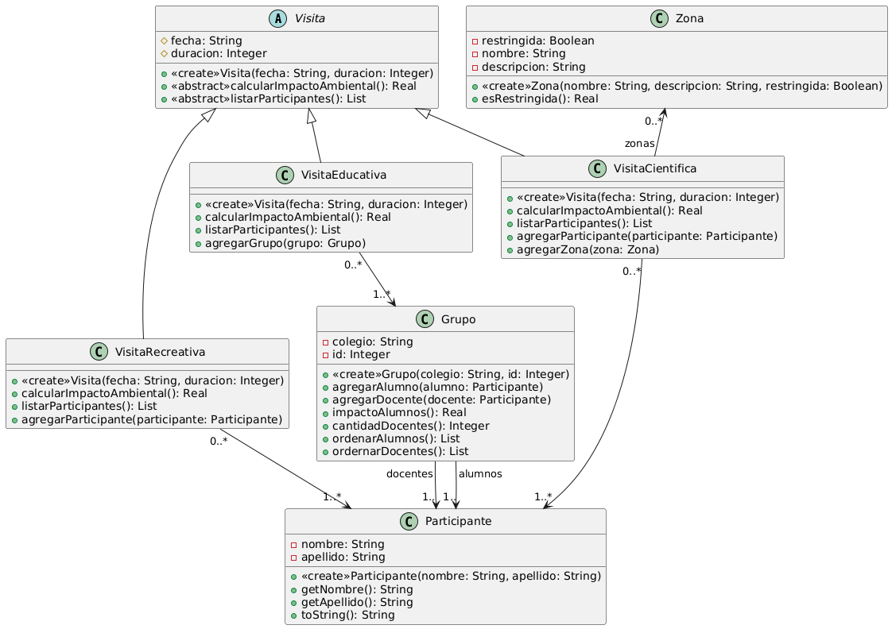

## Gestión del impacto ambiental de visitas en una reserva natural
Una reserva natural organiza visitas guiadas de distinas tipos. Las visitas tienen impacto
ambiental, y la reserva desea poder gestionar y evaluar ese impacto en función de las
características de cada visita.

Existen tres tipos de visita: recreativas, educativas y científicas. De cada visita se puede
obtener la fecha, la duración en horas y el listado de participantes.
Las visitas recreativas están dirigidas a turistas o familias. Su impacto ambiental se estima en 1
punto por participante por hora de duración.

Las visitas educativas son realizadas por grupos escolares. De la visita puede participar un
unico grupo o varios grupos. Los grupos que participan de una visita escolar se identifican con
el nombre del colegio, un identificador de grupo, una lista de docentes responsables, y una lista
de alumnos. El impacto ambiental de un grupo es de 0.5 punto por alumno por hora. A eso se
resta 1 punto por hora por cada docente responsable. Sin importar el tamaño del grupo, el
impacto mínimo de un grupo es 2 puntos por hora.

Las visitas científicas son solicitadas por investigadores y pueden requerir acceso a zonas
restringidas, lo cual incrementa su impacto. Su impacto ambiental tiene un valor base de 50
puntos, más 5 puntos por cada hora adicional a la primera. Si acceden zonas restringidas, se
suma un adicional de 100 puntos por cada zona. Al registrar la visita se indican las zonas a las
que accede. Se tiene un listado con las zonas restringidas. Para acotar el alcance de este
trabajo, de las zonas solo nos interesa tener su nombre y descripción.

Se desea implementar funcionalidad para:
* Calcular impacto ambiental de una visitas
* Obtener listado completo de asistentes de una visitas (ordenado alfabéticamente).

### Provea
1. Diagrama de clases UML
2. Implementación en Java la funcionalidad requerida
3. Pruebas automatizadas según las indicaciones dadas a continuación

### Para las pruebas
Diseñe los casos de prueba teniendo en cuenta los conceptos de valores de borde y particiones
de equivalentes vistos en la teoría. Documente los casos en una tabla como la que se muestra
a continuación. Cada fila de la tabla corresponde a un método de una clase que usted cree que
hay que testear. Por cada fila, indique con qué valores testear (el fixture). Si determinó los
valores utilizando la estrategia de valores de borde, indíquelo con una cruz en la columna VB.

## UML
