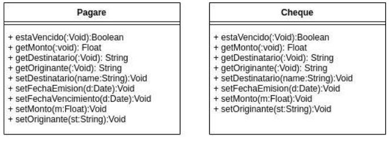
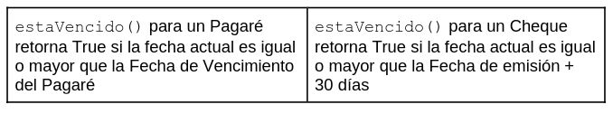

# Redictado de Objetos 1: Simulacro parcial Abril 2023

Consideres estas definiciones:
- Un cheque es una Orden Escrita de Pago (indica al Banco que le pague el monto
  indicado al portador del cheque dentro de los 30 días posteriores a la fecha de emisión,
  después de eso se considera vencido y no se puede pagar)
- Un pagaré es una Promesa Escrita de Pago (es un compromiso de pagar el monto
  indicado en la fecha indicada como vencimiento)

El siguiente diagrama UML muestra dos clases Pagare y Cheque con su correspondiente
protocolo

1. Dado que estas clases tienen tantas cosas en común, proponga una jerarquía en
   donde:
   a) Se generaliza el comportamiento de las clases presentadas
   b) Se muestran variables de instancia en lugar de getters y setters publicos
   c) Implemente en Java el método estaVencido() según la siguiente
   especificación:

2. Defina los constructores para las clases en Java
3. Considere que un objeto tiene una colección de cobros donde se guardan instancias de
   Cheques y Pagares. Se desea implementar el método #valorLiquido que retorna la
   suma de los valores de los cheques no vencidos más los valores de los pagarés
   vencidos. Implemente el método #valorLiquido y los mensajes necesarios para que su
   solución sea completa en Java
4. Realice los tests de unidad para estaVencido() de Cheque y Pagare